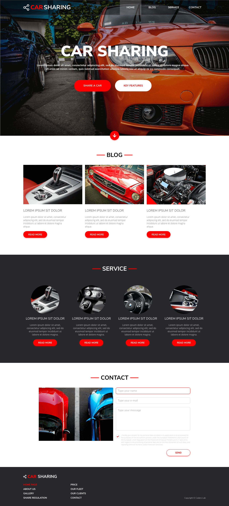

# Kilka ważnych informacji

Przed przystąpieniem do rozwiązywania zadań przeczytaj poniższe wskazówki

## Jak zacząć?

1. Stwórz [*fork*](https://guides.github.com/activities/forking/) repozytorium z zadaniami.
2. Sklonuj repozytorium na swój komputer. Użyj do tego komendy `git clone adres_repozytorium`
Adres repozytorium możesz znaleźć na stronie repozytorium po naciśnięciu w guzik "Clone or download".
3. Rozwiąż zadania i skomituj zmiany do swojego repozytorium. Użyj do tego komend `git add nazwa_pliku`.
Jeżeli chcesz dodać wszystkie zmienione pliki użyj `git add .` 
Pamiętaj że kropka na końcu jest ważna!
Następnie skommituj zmiany komendą `git commit -m "nazwa_commita"`
4. Wypchnij zmiany do swojego repozytorium na GitHubie.  Użyj do tego komendy `git push origin master`
5. Stwórz [*pull request*](https://help.github.com/articles/creating-a-pull-request) do oryginalnego repozytorium, gdy skończysz wszystkie zadania.

Poszczególne zadania rozwiązuj w odpowiednich plikach.

# Poniżej znajdziesz wytyczne do zadań

# Car Sharing

Link do projektu: [https://xd.adobe.com/view/19f36565-a886-47a4-45e4-47c2d02e4a8f-6fc2/](https://xd.adobe.com/view/19f36565-a886-47a4-45e4-47c2d02e4a8f-6fc2/).

## Kontener
Główny `container` ma `1088px`. W nim ma się zawierać cała treść strony. Obszar ponad `1088px` zostaje wykorzystany tylko do tła poszczególnych elementów.

## Fonty
Wykorzystane fonty to:
- Nunito Sans
- Open Sans

Oba dostępne są w Google Fonts. Ich kolory rozpisane są w AdobeXD.

## Grafiki
Można skorzystać z grafik przygotowanych w folderze `images`. Można również pobrać je bezpośrednio z projektu AdobeXD. 

## Przebieg prac

### Zadania wprowadzające
1. Stworzenie repozytorium dla projektu
1. Stworzenie w nim podstawowej struktury plików
1. Dodanie Normalize/Reset
1. Utworzenie początkowej struktury pliku HTML

### Zadania samodzielne
1. Przeanalizowanie cech wspólnych elementów na stronie
1. Przygotowanie listy zmiennych z kolorami, fontami czy odległościami używanymi w projekcie
1. Podzielenie prac na poszczególne sekcje. **Wykonujemy projekt małymi krokami!**
1. Tworzenie konstrukcji HTML a następnie stylowania CSS po kolei dla poszczególnych sekcji.

---

Repozytorium z ćwiczeniami zostanie usunięte 2 tygodnie po zakończeniu kursu. Spowoduje to też usunięcie wszystkich forków, które są zrobione z tego repozytorium.
